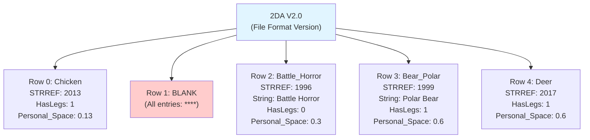

# BioWare Aurora Engine: Core Formats

*Official Bioware Aurora Documentation — Grouped Reference*

> This page groups related official BioWare Aurora Engine specifications for convenient reference. Each section below was originally a separate BioWare PDF, archived in [xoreos-docs](https://github.com/xoreos/xoreos-docs). The content is mirrored verbatim from the original documentation.

## Contents

- [BioWare Aurora Engine: Core Formats](#bioware-aurora-engine-core-formats)
  - [Contents](#contents)
- [GFF — Generic File Format](#gff--generic-file-format)
  - [1. Introduction](#1-introduction)
  - [2. File Format Conceptual Overview](#2-file-format-conceptual-overview)
    - [2.1. General Description](#21-general-description)
      - [Example: GFF Usage](#example-gff-usage)
    - [2.2. Field Data Types](#22-field-data-types)
      - [Gender](#gender)
      - [The Struct Data Type](#the-struct-data-type)
      - [The List Data Type](#the-list-data-type)
    - [2.3. Field Labels](#23-field-labels)
  - [3. File Format Physical Layout](#3-file-format-physical-layout)
    - [3.1. Overall File Layout](#31-overall-file-layout)
    - [3.2. Header](#32-header)
    - [3.3. Structs](#33-structs)
    - [3.4. Fields](#34-fields)
    - [3.5. Labels](#35-labels)
    - [3.6. Field Data Block](#36-field-data-block)
    - [3.7. Field Indices](#37-field-indices)
    - [3.8. List Indices](#38-list-indices)
  - [4. Complex Field Data: Descriptions and Physical Format](#4-complex-field-data-descriptions-and-physical-format)
    - [4.1. DWORD64](#41-dword64)
    - [4.2. INT64](#42-int64)
    - [4.3. DOUBLE](#43-double)
    - [4.4. CExoString](#44-cexostring)
    - [4.5. CResRef](#45-cresref)
    - [4.6. CExoLocString](#46-cexolocstring)
    - [4.7. VOID/binary](#47-voidbinary)
    - [4.8. Struct](#48-struct)
    - [4.9. List](#49-list)
    - [See also](#see-also)
- [2DA — Two-Dimensional Array](#2da--two-dimensional-array)
  - [1. Introduction](#1-introduction-1)
  - [2. General Concepts](#2-general-concepts)
      - [Whitespace Separating Columns](#whitespace-separating-columns)
      - [First Column](#first-column)
      - [Column Names](#column-names)
      - [Data Types](#data-types)
      - [Blank (`****`) Entries](#blank--entries)
      - [StrRefs](#strrefs)
  - [3. File Layout](#3-file-layout)
    - [Line 1 — File Format Version](#line-1--file-format-version)
    - [Line 2 — Blank or Optional Default](#line-2--blank-or-optional-default)
    - [Line 3 — Column Names](#line-3--column-names)
    - [Lines 4+ — Row Data](#lines-4--row-data)
  - [4. Maintenance](#4-maintenance)
    - [Column Rules](#column-rules)
    - [Row Rules](#row-rules)
    - [See also](#see-also-1)
- [KEY/BIF — Key and BIF File Formats](#keybif--key-and-bif-file-formats)
  - [1. Introduction](#1-introduction-2)
    - [1.1. Conventions](#11-conventions)
    - [1.2. Resource Management](#12-resource-management)
    - [1.3. Resource Types](#13-resource-types)
  - [2. Key File Format (KEY)](#2-key-file-format-key)
    - [2.1. Key File Structure](#21-key-file-structure)
    - [2.2. Header](#22-header)
    - [2.3. File Table](#23-file-table)
    - [2.4. Filename Table](#24-filename-table)
    - [2.5. Key Table](#25-key-table)
  - [3. BIF File Format (BIF)](#3-bif-file-format-bif)
    - [3.1. BIF Structure](#31-bif-structure)
    - [3.2. Header](#32-header-1)
    - [3.3. Variable Resource Table](#33-variable-resource-table)
    - [3.4. Fixed Resource Table](#34-fixed-resource-table)
    - [3.5. Variable Resource Data](#35-variable-resource-data)
    - [3.6. Fixed Resource Data](#36-fixed-resource-data)
    - [See also](#see-also-2)
- [ERF — Encapsulated Resource File Format](#erf--encapsulated-resource-file-format)
  - [Global ERF Structure](#global-erf-structure)
    - [ERF Header Format](#erf-header-format)
  - [ERF Localized String List](#erf-localized-string-list)
    - [String List Format](#string-list-format)
    - [String List Element Structure](#string-list-element-structure)
    - [Language IDs](#language-ids)
  - [ERF Key List](#erf-key-list)
    - [Key List Format](#key-list-format)
    - [Key Structure](#key-structure)
  - [ERF Resource List](#erf-resource-list)
    - [Resource List Format](#resource-list-format)
    - [Resource List Element Structure](#resource-list-element-structure)
  - [Resource Data](#resource-data)
  - [Resource Types](#resource-types)
    - [See also](#see-also-3)
- [TalkTable — dialog.tlk File Format](#talktable--dialogtlk-file-format)
  - [1. Introduction](#1-introduction-3)
    - [1.1. Conventions](#11-conventions-1)
  - [2. StringRefs](#2-stringrefs)
    - [2.1. Fetching a String by StringRef](#21-fetching-a-string-by-stringref)
    - [2.2. StringRef Definition](#22-stringref-definition)
    - [2.3. Specifying a Gender](#23-specifying-a-gender)
    - [2.4. Alternate Talk Tables](#24-alternate-talk-tables)
  - [3. TLK File Format](#3-tlk-file-format)
    - [3.1. TLK File Structure](#31-tlk-file-structure)
    - [3.2. Header](#32-header-2)
    - [3.3. String Data Table](#33-string-data-table)
    - [3.4. String Entry Table](#34-string-entry-table)
    - [See also](#see-also-4)
- [SSF — Sound Set File Format](#ssf--sound-set-file-format)
  - [1. Introduction](#1-introduction-4)
  - [2. Overall File Format](#2-overall-file-format)
  - [3. Header Format](#3-header-format)
  - [4. Entry Table](#4-entry-table)
  - [5. Data Table](#5-data-table)
  - [6. Entry Special Meanings](#6-entry-special-meanings)
  - [7. SoundSet 2DA Files](#7-soundset-2da-files)
    - [See also](#see-also-5)
- [LocalizedStrings — CExoLocString](#localizedstrings--cexolocstring)
  - [1. StringRef](#1-stringref)
  - [2. Embedded Strings with Language IDs](#2-embedded-strings-with-language-ids)
  - [3. Gender](#3-gender)
  - [4. LanguageID and Gender Combination](#4-languageid-and-gender-combination)
  - [5. Procedure to Fetch LocString Text](#5-procedure-to-fetch-locstring-text)
    - [See also](#see-also-6)

---

<a id="gff"></a>

# GFF — Generic File Format

*Official BioWare Aurora Documentation*

**Source:** Extracted from the official BioWare Aurora Engine GFF Format PDF, archived in [xoreos-docs `specs/bioware/GFF_Format.pdf`](https://raw.githubusercontent.com/xoreos/xoreos-docs/master/specs/bioware/GFF_Format.pdf) ([mirror: `specs/bioware/GFF_Format.pdf`](https://raw.githubusercontent.com/th3w1zard1/xoreos-docs/master/specs/bioware/GFF_Format.pdf)). Original from the defunct nwn.bioware.com developer site.

---

*BioWare Aurora Engine — Generic File Format (GFF)*

## 1. Introduction

The [Generic File Format (GFF)](GFF-File-Format) is an all-purpose generic format used to store data in BioWare games. It is designed to make it easy to add or remove fields and data structures while still maintaining backward and forward compatibility in reading old or new versions of a file format.

The backward and forward compatibility of [GFF](GFF-File-Format) was important to the development of BioWare's games because file formats changed rapidly. For example, if a designer needed creatures in the game to have a new property to store their Last Name, it was easy to add that field to the creature file format. New versions of the game and tools would write out the new field, and old versions would just ignore it.

> **Note**: This official BioWare documentation was originally written for **Neverwinter Nights**, but the GFF format is **identical in KotOR**. All file types and structures described here apply to KotOR as well. The examples reference NWN module structure, but KotOR modules use the same GFF-based file types.

In Neverwinter Nights (and KotOR), most of the non-plain-text data contained in a module is in
[GFF](GFF-File-Format), although the compiled scripts are a notable exception.
The following file types within a module are all in [GFF](GFF-File-Format) (applies to both NWN and KotOR):
- [Module info file (IFO)](GFF-File-Format#ifo)
- Area-related files: [area file (are)](GFF-File-Format#are), [game object instances and dynamic area properties (git)](GFF-File-Format#git), game instance comments (gic)
- Object Blueprints: creature (utc), door (utd), encounter (ute), item (uti), placeable (utp), sound (uts), store (utm), trigger (utt), waypoint (utw)
- [Conversation files (DLG)](GFF-File-Format#dlg)
- [Journal file (JRL)](GFF-File-Format#jrl)
- [Faction file (FAC)](GFF-File-Format#fac)
- [Palette file (ITP)](Bioware-Aurora-Module-and-Area#paletteitp)
- [Plot Wizard files: plot instance/plot manager file (PTM), plot wizard blueprint (PTT)](GFF-File-Format)
The following files created by the game are also [GFF](GFF-File-Format):
- Character/Creature File (BIC)

## 2. File Format Conceptual Overview

### 2.1. General Description

A [GFF](GFF-File-Format) file represents a collection of data. C programmers can think of this collection as a struct. Pascal programmers can think of it as a record. Each item (properly called a Field) of data has: a text Label, a data type, and a value. C programmers can think of Fields as member variables in a C struct.

The labelling of Fields is the key to GFF being able to maintain backward and forward compatibility between different file formats.

The above concepts are best illustrated by an example.

#### Example: GFF Usage

Let us use a simplified example of a Waypoint object. A Waypoint has a Tag that is used for scripting purposes, and it has a location. In C++ code, a Waypoint might be defined as follows:

```cpp
class TWaypoint
{
    TString m_sTag;
    float m_fPositionX;
    float m_fPositionY;
    float m_fPositionZ;
};
```

(Notes: In the above declaration, we have purposefully omitted member function declarations
because they are irrelevant to this example. Also, assume that a string class called TString has
already been defined)
Suppose we have an instance of a Waypoint tagged "ShopEntrance", located at (3.2, 5.7, 0.0) in some Area.

When saved to GFF, it would "look" like this:

| Field | Type | Value |
|-------|------|-------|
| Tag | string | ShopEntrance |
| PositionX | float | 3.200 |
| PositionY | float | 5.700 |
| PositionZ | float | 0.000 |

Now suppose we decide to add a MapNote property, which is a string that appears when the
player mouses over a Waypoint in the game's minimap, and a HasMapNote property to specify
whether the Waypoint appears on the minimap in the first place. The C++ declaration for the
Waypoint object might now be:

```c
class TWaypoint
{
TString m_sTag;

bool m_bHasMapNote;      // this was added
TString m_sMapNoteText;  // this was added

float m_fPositionX;
float m_fPositionY;
float m_fPositionZ;
};
```

If we try to load our old Waypoint instance from before, the program would still correctly load
the Tag and X, Y, Z coordinates because it reads them from the GFF file by finding their Labels
and reading the associated data. The fact that we just inserted some extra data inbetween the Tag
and coordinates is inconsequential. Reading Fields from a GFF file does not depend at all on the
physical position of Fields' bytes relative to each other within the file.
In this example, it is a simple matter from a programming perspective to notice that the old
Waypoint instance does not have a MapNoteText or HasMapNote property stored on it in the
GFF file. On seeing this, it is equally simple to set default values for those properties if their
GFF Fields were not found.

### 2.2. Field Data Types

Allowed GFF Field types are listed in the table below.

**Table 2.2a: Field Type Descriptions**

| Field Type | Size (bytes) | Description |
|---|---|---|
| BYTE | 1 | Unsigned single byte (0 to 255) |
| CHAR | 1 | Single character byte |
| WORD | 2 | Unsigned integer value (0 to 65535) |
| SHORT | 2 | Signed integer (−32,768 to 32,767) |
| DWORD | 4 | Unsigned integer (0 to 4,294,967,295) |
| INT | 4 | Signed integer (−2,147,483,648 to 2,147,483,647) |
| DWORD64 | 8 | Unsigned integer (0 to ~18 × 10¹⁸) |
| INT64 | 8 | Signed integer (~−9 × 10¹⁸ to +9 × 10¹⁸) |
| FLOAT | 4 | Floating point value |
| DOUBLE | 8 | Double-precision floating point value |
| CExoString | variable | Non-localized string (max. 1024 characters recommended) |
| CResRef | 16 | Filename of a game resource; max 16 characters (unused chars are nulls) |
| CExoLocString | variable | Localized string: contains a StringRef DWORD and zero or more CExoStrings, each with their own language ID |
| VOID | variable | Variable-length arbitrary data (raw bytes) |
| Struct | variable | Complex data type containing any number of any other data types, including other Structs |
| List | variable | A list of Structs |

**Notes on Complex Types:**

- **Void data:** Stores a stream of raw bytes as a single labeled item. Suitable for raw image or sound data; avoid dumping C structs directly—use primitive types instead.
- **CExoString:** Simple character string used primarily for developer/designer-only text (tags, scripts) rather than user-visible text.
- **CExoLocString:** Localized string for user-visible text with language support and optional embedded strings. Contains:
    1. **StringRef** — 32-bit integer index into `dialog.tlk` (−1 / 0xFFFFFFFF = invalid; valid range 0 to 0x00FFFFFF)
    2. **Embedded Strings with Language IDs** — Zero or more strings, each paired with a language ID (0–131; see Table 2.2b) for multi-language support


In the presence of both embedded strings and a valid StringRef, the behaviour is up to the
application. In the toolset, embedded strings take precedence, assuming that there is an
embedded string for the user's language. As with CExoStrings, embedded strings in
CExoLocStrings should be no more than 1024 characters.
The following is a list of languages and their IDs:

**Table 2.2b: Language IDs for LocStrings**

| Language | ID |
|---|---|
| English | 0 |
| French | 1 |
| German | 2 |
| Italian | 3 |
| Spanish | 4 |
| Polish | 5 |
| Korean | 128 |
| Chinese Traditional | 129 |
| Chinese Simplified | 130 |
| Japanese | 131 |

#### Gender

In addition to specifying a string by Language ID, substrings in a LocString have a gender associated with them. 0 = neutral or masculine; 1 = feminine. In some languages, the text that should appear would vary depending on the gender of the player, and this flag allows the application to choose an appropriate string.

#### The Struct Data Type
In addition to the primitive data types listed above, GFF has a compound data type called a
Struct. A Struct can contain any number of data Fields. Each Field can be any one of the above
listed Field types, including a Struct or List.
Regardless of what Fields are packed into a Struct, there is always a single integer value
associated with the Struct, which is the Struct ID. This ID is defined by the programmer who is
writing out GFF data, and can be used to identify a Struct without having to check what Fields it
contains. In many cases, though, the programmer already knows--or can assume--the Struct
structure simply by the context in which the Struct was found, in which case the ID is
unimportant.
Every GFF file contains at least one Struct at the top level of the file, containing all the other
data in the file. The Top-Level Struct does not have a LabelThe Top-Level Struct has a Struct ID
of 0xFFFFFFFF in hex.

#### The List Data Type

A List is simply a list of Structs. Like all GFF Fields, a List has a Label.
Structs that are elements of a List do not have Labels.

### 2.3. Field Labels

Every Field has a Label, a text string that identifies it. This Label can have up to 16 characters.
When a program writes out a structure in memory to disk as a GFF file, each field in that memory
structure is written out using the most appropriate GFF Field data type, and with a GFF Label
associated with it.
It is this labelling of data elements that makes GFF useful for storing data structures that are subject to
change. When new  information is added to a data structure, old GFF files can still be read because the

old data is fetched by Label rather than by offset. That is, no assumptions are made as to where one
variable is relative to another in the file.

## 3. File Format Physical Layout

This section describes what the actual bytes are in a GFF file, where they are, and what they do.

The file format descriptions in this section use the following terminology:

- `BYTE`: 1-byte (8-bit) unsigned integer
- `CHAR`: 1-byte (8-bit) character
- `DWORD`: 4-byte (32-bit) unsigned integer

Note that GFF byte order is **little endian**, which is the format used by Intel processors. If an integer value is more than 1 byte long, then the least significant byte is the first one, and the most significant byte is the last one. For example, the number 258 (`0x0102` in hex) expressed as a 4-byte integer would be stored as the following sequence of bytes within the file: `0x02, 0x01, 0x00, 0x00`.

### 3.1. Overall File Layout

A GFF file contains 7 distinct sections — 1 fixed-size header, 5 arrays of fixed-size elements, and 1 block of raw data. The offset to each section is stored in the header, as is the number of elements in each array.

**Figure 3.1: GFF File Structure**

| Section | Start Position | Description |
|---------|---|---|
| Header | Start of File | Fixed-size header containing metadata |
| Struct Array | StructOffset | Array of struct definitions |
| Field Array | FieldOffset | Array of field definitions |
| Label Array | LabelOffset | Array of field labels |
| Field Data Block | FieldDataOffset | Raw block of all complex-type field data |
| Field Indices Array | FieldIndicesOffset | Indices into Field Array for struct field lookups |
| List Indices Array | ListIndicesOffset | Indices into Struct Array for list element lookups |
### 3.2. Header

The GFF header contains a number of values, all of them DWORDs (32-bit unsigned integers). The header contains offset information for all the other sections in the GFF file. Values in the header are as follows, and arranged in the order listed:

**Table 3.2: Header Format** *(all values are DWORDs)*

| Field | Description |
|---|---|
| `FileType` | 4-char file type string (e.g. `"DLG "`, `"ITP "`) |
| `FileVersion` | 4-char GFF version string. At time of writing: `"V3.2"` |
| `StructOffset` | Byte offset of Struct array from beginning of file |
| `StructCount` | Number of elements in Struct array |
| `FieldOffset` | Byte offset of Field array from beginning of file |
| `FieldCount` | Number of elements in Field array |
| `LabelOffset` | Byte offset of Label array from beginning of file |
| `LabelCount` | Number of elements in Label array |
| `FieldDataOffset` | Byte offset of Field Data block from beginning of file |
| `FieldDataCount` | Number of bytes in Field Data block |
| `FieldIndicesOffset` | Byte offset of Field Indices array from beginning of file |
| `FieldIndicesCount` | Number of bytes in Field Indices array |
| `ListIndicesOffset` | Byte offset of List Indices array from beginning of file |
| `ListIndicesCount` | Number of bytes in List Indices array |
The FileVersion should always be "V3.2" for all GFF files that use the Generic File Format as
described in this document. If the FileVersion is different, then the application should abort reading the
GFF file.
The FileType is a programmer-defined 4-byte character string that identifies the content-type of the
GFF file. By convention, it is a 3-letter file extension in all-caps, followed by a space. For example,
"DLG ", "ITP ", etc. When opening a GFF file, the application should check the FileType to make
sure that the file being opened is of the expected type.

### 3.3. Structs

In a GFF file, Struct Fields are stored differently from other fields. Whereas most Fields are stored in the Field array, Structs are stored in the Struct Array.

The very first element in the Struct Array is the Top-Level Struct for the GFF file, and it "contains" all the other Fields, Structs, and Lists. In this sense, the word "contain" refers to conceptual containment (as in Section 2.1) rather than physical containment (as in Section 3). In other words, it does not imply that all the other Fields are physically located inside the Top-Level Struct on disk (in fact, all Structs have the same physical size on disk).

Since the Top-Level Struct is always present, every GFF file contains at least one element in the Struct Array.

The Struct Array looks like this:

**Figure 3.3: Struct Array**

| Position | Content | Notes |
|---|---|---|
| 0 | Top-Level Struct | Always present; Struct ID = `0xFFFFFFFF`; contains all other data |
| 1 | Struct 1 | First nested struct |
| 2 | Struct 2 | Second nested struct |
| ... | ... | |
| N-1 | Struct N-1 | Last struct |
| | **Total: N structs** | N = Header.StructCount (always ≥ 1) |

Physically, a GFF Struct contains the values listed in the table below. All of them are DWORDs.

**Table 3.3: Struct Format** *(all values are DWORDs)*

| Field | Description |
|---|---|
| `Struct.Type` | Programmer-defined integer ID. (Top-Level Struct always has `0xFFFFFFFF`.) |
| `Struct.DataOrDataOffset` | If `Struct.FieldCount = 1`: an index into the Field Array. If `Struct.FieldCount > 1`: a byte offset into the Field Indices array, where there is an array of DWORDs (each an index into the Field Array) with `Struct.FieldCount` elements. |
| `Struct.FieldCount` | Number of fields in this Struct. |

The above table shows that the Fields that a Struct conceptually contains are referenced indirectly via the `DataOrDataOffset` value.

Struct 0, which is the Top-Level Struct, always has a Type (aka Struct ID) of `0xFFFFFFFF`.

### 3.4. Fields

The Field Array contains all the Fields in the GFF file except for the Top-Level Struct.

**Figure 3.4: Field Array**

| Position | Content | Notes |
|---|---|---|
| 0 | Field 0 | First field |
| 1 | Field 1 | Second field |
| 2 | Field 2 | Third field |
| ... | ... | |
| N-1 | Field N-1 | Last field |
| | **Total: N fields** | N = Header.FieldCount |

Each Field contains the values listed in the table below. All of the values are DWORDs.

**Table 3.4a: Field Format** *(all values are DWORDs)*

| Field | Description |
|---|---|
| `Field.Type` | Data type identifier (see Table 3.4b) |
| `Field.LabelIndex` | Index into the Label Array |
| `Field.DataOrDataOffset` | If `Field.Type` is a **simple** type: the actual value of the field. If `Field.Type` is a **complex** type: byte offset into the Field Data block. |

The Field Type specifies what data type the Field stores (recall the data types from Section 2.2). The following table lists the values for each Field type. A datatype is considered complex if it would not fit within a DWORD (4 bytes).

**Table 3.4b: Field Type IDs**

| Type ID | Type | Complex? |
|---|---|---|
| 0 | `BYTE` | |
| 1 | `CHAR` | |
| 2 | `WORD` | |
| 3 | `SHORT` | |
| 4 | `DWORD` | |
| 5 | `INT` | |
| 6 | `DWORD64` | yes |
| 7 | `INT64` | yes |
| 8 | `FLOAT` | |
| 9 | `DOUBLE` | yes |
| 10 | `CExoString` | yes |
| 11 | `ResRef` | yes |
| 12 | `CExoLocString` | yes |
| 13 | `VOID` | yes |
| 14 | `Struct` | yes\* |
| 15 | `List` | yes\*\* |
Non-complex Field data is contained directly within the Field itself, in the DataOrDataOffset member.
If the data type is smaller than a DWORD, then the first bytes of the DataOrDataOffset DWORD, up to
the size of the data type itself, contain the data value.
If the Field data is complex, then the DataOrDataOffset value is equal to a byte offset from the
beginning of the Field Data Block, pointing to the raw bytes that represent the complex data. The exact
method of fetching the complex data depends on the actual Field Type, and is described in Section 4.
*As a special case, if the Field Type is a Struct, then DataOrDataOffset is an index into the Struct Array
instead of a byte offset into the Field Data Block.
**As another special case, if the Field Type is a List, then DataOrDataOffset is a byte offset from the
beginning of the List Indices Array, where there is a DWORD for the size of the array followed by an
array of DWORDs.  The elements of the array are offsets into the Struct Array. See Section 4.9 for
details.

### 3.5. Labels

A Label is a 16-`CHAR` array. Unused characters are nulls, but the label itself is non-null-terminated, so a 16-character label would use up all 16 `CHAR`s with no null at the end.

The Label Array is a list of all the Labels used in a GFF file.

Note that a single Label may be referenced by more than one Field. When multiple Fields have Labels with the exact same text, they share the same Label element instead of each having their own copy. This sharing occurs regardless of what Struct the Field belongs to. All Labels in the Label Array should be unique.

Also, the Fields belonging to a Struct must all use different Labels. It is permissible, however, for Fields in two different Structs to use the same Label, regardless of whether one of those Structs is conceptually contained inside the other Struct.

**Figure 3.5: Label Array**

| Position | Content | Notes |
|---|---|---|
| 0 | Label 0 | First label |
| 1 | Label 1 | Second label |
| 2 | Label 2 | Third label |
| ... | ... | |
| N-1 | Label N-1 | Last label |
| | **Total: N labels** | N = Header.LabelCount |

### 3.6. Field Data Block

The Field Data block contains raw data for any Fields that have a complex Field Type, as described in Section 3.4. The two exceptions to this rule are Struct and List Fields, which are not stored in the Field Data Block.

The `FieldDataCount` in the GFF header specifies the number of BYTEs contained in the Field Data block.

The data in the Field Data Block is laid out according to the type of Field that owns each byte of data. See Section 4 for details.

### 3.7. Field Indices

A Field Index is a DWORD containing the index of the associated Field within the Field array.

The Field Indices Array is an array of such DWORDs.

### 3.8. List Indices

The List Indices Array contains a sequence of List elements packed end-to-end.

A List is an array of Structs, and being array, its length is variable. The format of a List is as shown below:

**Figure 3.8: List Format**

| Field | Type | Description |
|---|---|---|
| Size | DWORD | Number of Struct indices that follow |
| Index 0 | DWORD | Pointer to first struct in Struct Array |
| Index 1 | DWORD | Pointer to second struct in Struct Array |
| Index 2 | DWORD | Pointer to third struct in Struct Array |
| ... | ... | |
| Index N-1 | DWORD | Pointer to last struct in Struct Array |
| | **Where N** | **= Size** |

The first DWORD is the Size of the List, and it specifies how many Struct elements the List contains.
There are Size DWORDS after that, each one an index into the Struct Array.
## 4. Complex Field Data: Descriptions and Physical Format

This section describes the byte-by-byte makeup of each of the complex Field types' data, as they are stored in the Field Data Block.

### 4.1. DWORD64

A DWORD64 is a 64-bit (8-byte) unsigned integer. As with all integer values in GFF, the least
significant byte comes first, and the most significant byte is last.

### 4.2. INT64

An INT64 is a 64-bit (8-byte) signed integer. As with all integer values in GFF, the least significant
byte comes first, and the most significant byte is last.

### 4.3. DOUBLE

A DOUBLE is a double-precision floating point value, and takes up 8 bytes. It is stored in little-endian byte order, with the least significant byte first.

(Both the `FLOAT` and `DOUBLE` data types conform to IEEE Standard 754-1985.)

### 4.4. CExoString

A CExoString is a simple character string datatype. The figure below shows the layout of a CExoString:

**Figure 4.4: CExoString Format**

| Field | Type | Size | Description |
|---|---|---|---|
| Size | DWORD | 4 bytes | Number of characters (no null terminator) |
| char 0 | CHAR | 1 byte | First character |
| char 1 | CHAR | 1 byte | Second character |
| ... | ... | ... | |
| char N-1 | CHAR | 1 byte | Last character |
| | **Total** | **N + 4 bytes** | **N = Size** |

A CExoString begins with a single DWORD (4-byte unsigned integer) which stores the string's Size. It specifies how many characters are in the string. This character-count does not include a null terminator. If we let N equal the number stored in Size, then the next N bytes after the Size are the characters that make up the string. There is no null terminator.

Example: The string `"Test"` would consist of the following byte sequence:

```
0x04 0x00 0x00 0x00 'T' 'e' 's' 't'
```

### 4.5. CResRef

A CResRef is used to store the name of a file used by the game or toolset. These files may be located in the BIF files in the user's data folder, inside an Encapsulated Resource File (ERF, MOD, or HAK), or in the user's override folder. For efficiency and to reduce network bandwidth, a ResRef can only have up to 16 characters and is not null-terminated. ResRefs are also non-case-sensitive and stored in all-lowercase.

The diagram below shows the structure of a CResRef stored in a GFF:

**Figure 4.5: CResRef Format**

| Field | Type | Size | Description |
|---|---|---|---|
| Size | BYTE | 1 byte | Number of characters (max 16, no null terminator) |
| char 0 | CHAR | 1 byte | First character |
| char 1 | CHAR | 1 byte | Second character |
| ... | ... | ... | |
| char N-1 | CHAR | 1 byte | Last character |
| | **Total** | **N + 1 bytes** | **N = Size (≤ 16)** |

The first byte is a Size, an unsigned value specifying the number of characters to follow. The Size is 16 at most. The character string contains no null terminator.

### 4.6. CExoLocString

A CExoLocString is a localized string. It can contain 0 or more CExoStrings, each one for a different language and possibly gender. For a list of language IDs, see Table 2.2b.

The figure below shows the layout of a CExoLocString.

**Figure 4.6a: CExoLocString Format**

| Field | Type | Description |
|---|---|---|
| Total Size | DWORD | Total bytes after this field |
| StringRef | DWORD | Index into dialog.tlk (0xFFFFFFFF = invalid) |
| StringCount | DWORD | Number of SubStrings that follow |
| SubString 0 | Variable | First substring |
| SubString 1 | Variable | Second substring |
| ... | ... | |
| SubString N-1 | Variable | Last substring |
| | **Where N** | **= StringCount** |

A CExoLocString begins with a single DWORD (4-byte unsigned integer) which stores the total number of bytes in the CExoLocString, not including the first 4 size bytes.

The next 4 bytes are a DWORD containing the StringRef of the LocString. The StringRef is an index into the user's `dialog.tlk` file, which contains a list of almost all the localized text in the game and toolset. If the StringRef is -1 (i.e., `0xFFFFFFFF`), then the LocString does not reference `dialog.tlk` at all.

The 4 bytes after the StringRef comprise the StringCount, a DWORD that specifies how many SubStrings the LocString contains. The remainder of the LocString is a list of SubStrings.

A LocString SubString has almost the same format as a CExoString, but includes an additional String ID at the beginning.

**Figure 4.6b: CExoLocString SubString Format**

| Field | Type | Size | Description |
|---|---|---|---|
| StringID | INT | 4 bytes | Calculated as: (2 × LanguageID) + Gender (0=masculine, 1=feminine) |
| StringLength | INT | 4 bytes | Number of characters (no null terminator) |
| char 0 | CHAR | 1 byte | First character |
| char 1 | CHAR | 1 byte | Second character |
| ... | ... | ... | |
| char N-1 | CHAR | 1 byte | Last character |
| | **Total** | **N + 8 bytes** | **N = StringLength** |

The StringID stored in a GFF file does not match up exactly to the LanguageIDs shown in Table 2.2b. Instead, it is 2 times the Language ID, plus the Gender (0 for neutral or masculine, 1 for feminine).

If we let N equal the number stored in StringLength, then the N bytes after the StringLength are the characters that make up the string. There is no null terminator.
### 4.7. VOID/binary

Void data is an arbitrary sequence of bytes to be interpreted by the application in a programmer-defined fashion. The format is shown below:

**Figure 4.7: VOID Format**

| Field | Type | Size | Description |
|---|---|---|---|
| Size | DWORD | 4 bytes | Number of data bytes |
| byte 0 | RAW | 1 byte | First byte of raw data |
| byte 1 | RAW | 1 byte | Second byte of raw data |
| ... | ... | ... | |
| byte N-1 | RAW | 1 byte | Last byte of raw data |
| | **Total** | **N + 4 bytes** | **N = Size** |

Size is a DWORD containing the number of bytes of data. The data itself is contained in the N bytes that follow, where N is equal to the Size value.

### 4.8. Struct

Unlike most of the complex Field data types, a Struct Field's data is located not in the Field Data Block, but in the Struct Array.

Normally, a Field's `DataOrDataOffset` value would be a byte offset into the Field Data Block, but for a Struct, it is an index into the Struct Array.

For information on the layout of a Struct, see Section 3.3, with particular attention to Table 3.3.

### 4.9. List

Unlike most of the complex Field data types, a List Field's data is located not in the Field Data Block, but in the Field Indices Array.

The starting address of a List is specified in its Field's `DataOrDataOffset` value as a byte offset into the Field Indices Array, at which is located a List element. Section 3.8 describes the structure of a List element.

### See also

- [GFF-File-Format](GFF-File-Format) -- KotOR GFF implementation and field types
- [GFF-ARE](GFF-Module-and-Area#are)
- [GFF-IFO](GFF-Module-and-Area#ifo)
- [GFF-UTI](GFF-Items-and-Economy#uti)
- [GFF-UTC](GFF-Creature-and-Dialogue#utc) -- KotOR GFF-based resources
- [Container-Formats#key](Container-Formats#key) -- Resource resolution
- [TSLPatcher GFFList Syntax](TSLPatcher-GFF-Syntax#gfflist-syntax) -- Patching GFF


---

<a id="2da"></a>

# 2DA — Two-Dimensional Array

*Official Bioware Aurora Documentation*

> **Note**: This official BioWare documentation was originally written for **Neverwinter Nights**, but the 2DA format is **identical in KotOR**. All structures, fields, and behaviors described here apply to KotOR as well. The examples may reference NWN-specific features, but the core format is the same.

**Source:** This documentation is extracted from the official BioWare Aurora Engine 2DA Format PDF, archived in **[xoreos-docs -- specs/bioware/2DA_Format.pdf`](https://raw.githubusercontent.com/xoreos/xoreos-docs/master/specs/bioware/2DA_Format.pdf)**. The original documentation was published on the now-defunct *nwn.bioware.com* developer site.

---

*BioWare Aurora Engine — 2DA File Format*

## 1. Introduction

A [*2DA*](2DA-File-Format) file is a plain-text file that describes a 2-dimensional array of data.
In BioWare's games, [2DA files](2DA-File-Format) serve many purposes, and are often crucial to the proper functioning of the game and tools. They describe many aspects of the rules and game engine.
Although [2DA files](2DA-File-Format) are plain text files, they are structured according to a set of rules that must be followed in order for the game and tools to read them correctly.

## 2. General Concepts

The main body of a 2da file is a table containing rows and columns of data. Each individual data element at a given row/column coordinate is called an entry. The data may be text, integer, or floating point values.

Consider the following example of the contents of a 2da file:



The above example illustrates several points elaborated on below.

#### Whitespace Separating Columns

Each column is separated by one or more spaces. The exact number of spaces does not matter, so long as there is at least one space character. The columns do not have to line up exactly, as shown by row 3 in the example above.

> **Important:** Do not use tab characters to separate columns.

#### First Column

The first column always contains the row number, with the first row being numbered 0, and all subsequent rows incrementing upward from there.

The first column is the only column that does not have a heading.

Note that the numbering in the first column is for the convenience of the person reading or editing the 2da file. The game and tools automatically keep track of the index of each row, so if a row is numbered incorrectly, the game and tools will still use the correct number for the row index. Nevertheless, it is a good habit to make sure that rows are numbered correctly to avoid confusion.

#### Column Names

All columns after the first one must have a heading. The heading can be in upper or lower case letters and may contain underscores.

#### Data Types

There are three types of data that may be present in a 2da. All data under a given column must be of the same type. The data types are:

- **String:** a string can be any arbitrary sequence of characters. However, if the string contains spaces, then it must be enclosed by quotation mark characters (`"`) because otherwise, the text after the space will be considered to belong to the next column. The string itself can never contain a quotation mark.
- **Integer:** an integer can be up to 32-bits in size, although the application reading the integer entry is free to assume that the value is actually of a smaller type. For example, boolean values are stored in a 2da as integers, so the column for a boolean property should only contain `0`s or `1`s.
- **Float:** a 32-bit floating point value.

The 2da format does not include data type information for each column because the application that reads the data from the 2da already knows what datatype to assume each column contains.

#### Blank (`****`) Entries

The special character sequence `****` indicates that an entry contains no data, or the value is not applicable. Note that this character sequence contains exactly 4 asterisk characters, no more and no less.
When deleting a row from a 2da file, all columns in that row should be filled with `****`s.
The `****` value is also used to indicate "N/A".

An attempt to read a String from a `****` entry should return an empty string (`""`). An attempt to read an Integer or Float should return `0`. The programming function that performed the reading operation should indicate that the read attempt failed so that the application knows that the entry value is no ordinary `""` or `0`.

#### StrRefs

One common use of Integer columns is to store StringRefs (or StrRefs). A StrRef is an index into the user's `dialog.tlk` file, which contains strings in the user's native language. When a 2da file includes information that relates to text that needs to be displayed to the user, that text is not embedded directly in the 2da file itself. Instead, the 2da contains the StrRef for the text.

Using StrRefs in a 2da allows all languages to use the same copy of a 2da. Instead of providing a few hundred different 2das for each language, it is only necessary to change a single file, `dialog.tlk`.
## 3. File Layout

### Line 1 — File Format Version

The first line of a 2da file describes the version of the 2da format followed by the 2da file. The current version header at the time of this writing is:

```
2DA V2.0
```

### Line 2 — Blank or Optional Default

The second line of a 2da file is usually empty.
Optionally, it can specify a default value for all entries in the file. The syntax is:

```
DEFAULT: <text>
```

where `<text>` is the default value to use. Note that the default text is subject to the same whitespace rules as any other column in a 2da. A string containing spaces must therefore be enclosed by quotation marks.
The default value will be returned when a requested row and column has no data, such as when asking for data from a row that does not exist. For String requests, the default text is returned as a string. For Integer or Floating point requests, the default will be converted to an Integer or Floating point value as appropriate. If the default string cannot be converted to a numerical type, the return value will be `0`. The programming function that reads the 2da entry should indicate that the read attempt failed.

The default value is not returned when a requested entry is `****`. An entry that contains `****` will return a blank string or zero.

### Line 3 — Column Names

The third line of a 2da file contains the names of each column. Each column name is separated from the others by one or more space characters. The exact number of spaces does not matter, so long as there is at least one.

A column name contains alphanumeric characters or underscores, and can begin with any of these characters (i.e., not restricted to starting with a letter).

### Lines 4+ — Row Data

All lines after and including line 4 are data rows.
Each column in a row is separated from the other columns by one or more space characters. When viewing the contents of a 2da using a fixed-width font, the columns in each row do not have to visually line up with the columns in the other rows, but for ease of reading, it is best to line them up anyway.

The very first column in a row is the row's index. The first data row (line 4) has an index of 0, the second data row (line 5) has an index of 1, and so on.

Every row must contain the exact same number of columns as there are column names given in line 3, plus one (since the index column has no name).

If the data for a column is a string that contains spaces, then the data for that column should begin with a quotation mark and end with a quotation mark. Otherwise, the text after the space will be considered to belong to the next column. Because of how quotation marks are handled, a string entry in a 2da can never contain actual quotation marks itself.

## 4. Maintenance

After a 2da file has been created and support for it has been added to the game and/or tools, it will often be necessary to make changes to the 2da. The following rules govern how to safely make changes.

### Column Rules

Applications may reference a column by position (column 0, column 1, etc.) or by name. To avoid breaking code that depends on column position, the following rules apply:

- Always add new columns after the very last column.
- Never insert a new column inbetween two existing ones or as the first one.
- Never delete a column from a 2da.
- Never rename a column.
- When adding a column, make sure that all rows include entries for the new column.
### Row Rules

Many game object properties are integer values that serve as indices into particular 2da files. Consequently, care must be taken when changing 2da row data to ensure that a minimum amount of existing data is affected by the change.
Always add rows to the very end of the file.
Never insert a row inbetween two other existing rows.
Never delete a row. If it is necessary to remove the data in a row, fill the row with **** entries instead.
Try to ensure that no existing data, in a 2da or otherwise, references the starred-out row.

### See also

- [2DA-File-Format](2DA-File-Format) -- KotOR 2DA implementation and column reference
- [TSLPatcher HACKList Syntax](TSLPatcher-Install-and-Hack-Syntax#hacklist-syntax)
- [TSLPatcher 2DAList Syntax](TSLPatcher-Data-Syntax#2dalist-syntax) -- Patching 2DA
- [Container-Formats#key](Container-Formats#key) -- Resource resolution


---

<a id="keybif"></a>

# [KEY/BIF](Container-Formats#bif) — Key and BIF File Formats

*Official Bioware Aurora Documentation*

> **Note**: This official BioWare documentation was originally written for **Neverwinter Nights**, but the KEY and BIF formats are **identical in KotOR**. All structures, fields, and behaviors described here apply to KotOR as well. The examples may reference NWN-specific features, but the core format is the same.

**Source:** This documentation is extracted from the official BioWare Aurora Engine KeyBIF Format PDF, archived in [`xoreos-docs/specs/bioware/KeyBIF_Format.pdf`](https://raw.githubusercontent.com/xoreos/xoreos-docs/master/specs/bioware/KeyBIF_Format.pdf). The original documentation was published on the now-defunct *nwn.bioware.com* developer site.

---

*BioWare Aurora Engine — Key and BIF File Formats*

## 1. Introduction

BioWare's games and tools make use of a very large number of files that are packed into a group of files having the `.bif` extension. The contents of the `.bif` files are described by one or more files having the `.key` extension.

### 1.1. Conventions

This document describes file formats. In all file formats discussed herein, file byte ordering is **little endian**, which is the format used by Intel processors. If a value is more than 1 byte long, then the least significant byte is the first one, and the most significant byte is the last one.

For example, the number 258 (`0x0102` in hex) expressed as a 4-byte integer would be stored as the following sequence of bytes within the file: `0x02, 0x01, 0x00, 0x00`.

The following terms are used in this document to refer to integer types:

- `WORD`: 16-bit (2-byte) unsigned integer
- `DWORD`: 32-bit (4-byte) unsigned integer

### 1.2. Resource Management
The game and toolset both use the same resource management system for requesting game
resources (ie., files).
Any resource can be obtained simply by specifying a ResRef (filename restricted to 16 characters
or less) and ResType (file type). The resource manager handles all the details of getting that
resource from whereever it is physically located, which may be in a folder, packed inside a BIF or
HAK file, etc. If there is more than one copy of a given file, then one of them overrides all the
others, as determined by rules outlined later in this section.
The resource manager has 3 types of source from which it builds its list of resources:
- keytable: a .key file, typically located in the same directory as the application itself. A keyfile
provides information regarding the contents of a set of .bif files, and each bif file contains
files that are used as game resources. (Examples of keytable files: chitin.key, xp1.key,
patch.key. Examples of .bif files: any of the .bif files in the data folder). The key and bif
formats will be discussed in much greater detail later in this document.
- directories: an ordinary directory containing game resource files. (Examples of resource
directories: override, modules\temp0)
- encapsulated file: an encapsulated resource file (ERF), which contains other files used as
game resources. (Examples of encapsulated files: hak paks located in hak folder, erf files
located in texturepacks folder). See the ERF Format document for details on the encapsulated
resouce file format.

There can be any number of resource sources of each type. If there is more than one resource with
the same name and type located in more than one resource source, then the following rules
determine which copy of that resource takes priority:
The last resource source of a given type overrides the first source of that type.
Example: the toolset adds the override directory to the resource manager on startup, but the
module temp directory is created and added to the resource manager only after creating a module.
Thus, files the temp directory take precedence over those in the override directory.
Encapsulated files have the highest priority, then directories, then keytables, regardless of the
order they were added to the resource manager.
Example: suppose that the following were added to the resource manager one after another:
chitin.key, patch.key, override folder, textures_tpa.erf, modules\temp0 folder, customcontent.hak.
The resource manager will place them, in order of lowest to highest priority, as: chitin.key,
patch.key, override folder, modules\temp0 folder, textures_tpa.erf, customcontent.hak. If both
your module and the customcontent.hak file both contained a script called ns_test00, then the one
in the hak file would be used.
### 1.3. Resource Types
All Resources have a Resource Type (ResType) that corresponds to their file type. Resources are
stored in BIFs and ERFs without their file extensions, but with their ResTypes instead.
The table below lists ResTypes for resources that may be stored in a BIF or ERF. All ResTypes
from 0 to 2999, 9000 to 9999, and 0xFFFF are reserved.

| ResType | File Extension | Content Type | Description |
|---------|----------------|--------------|-------------|
| 0xFFFF | N/A | N/A | Invalid resource type |
| 1 | bmp | binary | Windows BMP file |
| 3 | tga | binary | TGA image format |
| 4 | wav | binary | WAV sound file |
| 6 | plt | binary | Bioware Packed Layered Texture, used for player character skins, allows for multiple color layers |
| 7 | ini | text (ini) | Windows INI file format |
| 10 | txt | text | Text file |
| 2002 | mdl | mdl | Aurora model |
| 2009 | nss | text | NWScript Source |
| 2010 | ncs | binary | NWScript Compiled Script |
| 2012 | are | gff | BioWare Aurora Engine Area file. Contains information on what tiles are located in an area, as well as other static area properties that cannot change via scripting. For each .are file in a .mod, there must also be a corresponding .git and .gic file having the same ResRef. |
| 2013 | set | text (ini) | BioWare Aurora Engine Tileset |
| 2014 | ifo | gff | Module Info File. See the IFO Format document. |
| 2015 | bic | gff | Character/Creature |
| 2016 | wok | mdl | Walkmesh |
| 2017 | 2da | text | 2-D Array |
| 2022 | txi | text | Extra Texture Info |
| 2023 | git | gff | Game Instance File. Contains information for all object instances in an area, and all area properties that can change via scripting. |
| 2025 | uti | gff | Item Blueprint |
| 2027 | utc | gff | Creature Blueprint |
| 2029 | dlg | gff | Conversation File |
| 2030 | itp | gff | Tile/Blueprint Palette File |
| 2032 | utt | gff | Trigger Blueprint |
| 2033 | dds | binary | Compressed texture file |
| 2035 | uts | gff | Sound Blueprint |
| 2036 | ltr | binary | Letter-combo probability info for name generation |
| 2037 | gff | gff | Generic File Format. Used when undesirable to create a new file extension for a resource, but the resource is a GFF. (Examples of GFFs include itp, utc, uti, ifo, are, git) |
| 2038 | fac | gff | Faction File |
| 2040 | ute | gff | Encounter Blueprint |
| 2042 | utd | gff | Door Blueprint |
| 2044 | utp | gff | Placeable Object Blueprint |
| 2045 | dft | text (ini) | Default Values file. Used by area properties dialog |
| 2046 | gic | gff | Game Instance Comments. Comments on instances are not used by the game, only the toolset, so they are stored in a gic instead of in the git with the other instance properties. |
| 2047 | gui | gff | Graphical User Interface layout used by game |
| 2051 | utm | gff | Store/Merchant Blueprint |
| 2052 | dwk | mdl | Door walkmesh |
| 2053 | pwk | mdl | Placeable Object walkmesh |
| 2056 | jrl | gff | Journal File |
| 2058 | utw | gff | Waypoint Blueprint. See Waypoint GFF document. |
| 2060 | ssf | binary | Sound Set File. See Sound Set File Format document |
| 2064 | ndb | binary | Script Debugger File |
| 2065 | ptm | gff | Plot Manager file/Plot Instance |
| 2066 | ptt | gff | Plot Wizard Blueprint |


**Table 1.3.2: Resource Content Types**

| Content Type | Description |
|---|---|
| `binary` | Binary file format. Details vary widely as to implementation. |
| `text` | Plain text file. For some text resources, it doesn't matter whether lines are terminated by `CR+LF` or just `CR` characters, but for other text resources it might matter. To avoid complications, always use `CR+LF` line terminators. |
| `text (ini)` | Windows INI file format. Special case of a text file. |
| `gff` | BioWare Generic File Format. See the Generic File Format document. |
| `mdl` | BioWare Aurora model file format. Can be plain text or binary. |

## 2. Key File Format (KEY)

A Key file is an index of all the resources contained within a set of BIF files. The key file contains information as to which BIFs it indexes for and what resources are contained in those BIFs.

### 2.1. Key File Structure

**Figure 2.1: Key File Structure**

| Section | Start Position | Description |
|---|---|---|
| Header | Start of File | File metadata and offsets |
| File Table | OffsetToFileTable | List of BIF file entries |
| Filename Table | (follows File Table) | Filenames of all referenced BIF files |
| Key Entries Table | OffsetToKeyTable | Resource entries for all BIF contents |

### 2.2. Header

**Table 2.2: Keyfile Header**

| Field | Type | Description |
|---|---|---|
| `FileType` | 4 char | `"KEY "` |
| `FileVersion` | 4 char | `"V1  "` |
| `BIFCount` | DWORD | Number of BIF files that this KEY file controls |
| `KeyCount` | DWORD | Number of Resources in all BIF files linked to this keyfile |
| `OffsetToFileTable` | DWORD | Byte offset of File Table from beginning of this file |
| `OffsetToKeyTable` | DWORD | Byte offset of Key Entry Table from beginning of this file |
| `Build Year` | DWORD | Number of years since 1900 |
| `Build Day` | DWORD | Number of days since January 1 |
| `Reserved` | 32 bytes | Reserved for future use |
### 2.3. File Table

The File Table is a list of all the BIF files that are associated with the key file.
The number of elements in the File Table is equal to the `BIFCount` specified in the Header.
Each element in the File Table is a File Entry, and describes a single BIF file.

**Table 2.3: File Entry**

| Field | Type | Description |
|---|---|---|
| `FileSize` | DWORD | File size of the BIF. |
| `FilenameOffset` | DWORD | Byte position of the BIF file's filename in this file. Points to a location in the Filename Table. |
| `FilenameSize` | WORD | Number of characters in the BIF's filename. |
| `Drives` | WORD | A number that represents which drives the BIF file is located in. Currently each bit represents a drive letter (e.g., bit 0 = HD0, which is the directory where the application was installed). |

### 2.4. Filename Table

The Filename Table lists the filenames of all the BIF files associated with the key file.
Each File Entry in the File Table has a `FilenameOffset` that indexes into a Filename Entry in the Filename Table.

**Table 2.4: Filename Entry**

| Field | Type | Description |
|---|---|---|
| `Filename` | variable | Filename of the BIF as a non-terminated character string. This filename is relative to the "drive" where the BIF is located (as specified in the `Drives` field of the BIF File Entry). Each Filename must be unique. e.g., `"data\2da.bif"` |

### 2.5. Key Table

The Key Table is a list of all the resources in all the BIFs associated with this key file.
The number of elements in the Key Table is equal to the `KeyCount` specified in the Header.
Each element in the Key Table is a Key Entry, and describes a single resource. A resource may be a Variable Resource, or it may be a Fixed Resource (at this time, all resources are Variable).

**Table 2.5: Key Entry**

| Field | Type | Description |
|---|---|---|
| `ResRef` | 16 char | The filename of the resource item without its extension. The game uses this name to access the resource. Each `ResRef` must be unique. |
| `ResourceType` | WORD | Resource Type of the Resource. |
| `ResID` | DWORD | A unique ID number generated as follows: `Variable: ID = (x << 20) + y` / `Fixed: ID = (x << 20) + (y << 14)` where `x` = Index into File Table to specify a BIF, `y` = Index into Variable or Fixed Resource Table in BIF (`<<` = bit shift left). |

## 3. BIF File Format (BIF)

A BIF contains multiple resources (files). It does not contain information about each resource's name, and therefore requires its KEY file.

### 3.1. BIF Structure

**Figure 3.1: BIF File Structure**

| Section | Start Position | Description |
|---|---|---|
| Header | Start of File | File metadata and offsets |
| Variable Resource Table | Variable TableOffset | Entries describing variable resources |
| Fixed Resource Table | (follows Variable Table) | Entries describing fixed resources (if any) |
| Variable Resource Data | (follows Fixed Table) | Raw data for variable resources |
| Fixed Resource Data | (follows Variable Data) | Raw data for fixed resources |

### 3.2. Header

**Table 3.2: BIF Header Format**

| Field | Type | Description |
|---|---|---|
| `FileType` | 4 char | `"BIFF"` |
| `Version` | 4 char | `"V1  "` |
| `Variable Resource Count` | DWORD | Number of variable resources in this file. |
| `Fixed Resource Count` | DWORD | Number of fixed resources in this file. |
| `Variable Table Offset` | DWORD | Byte position of the Variable Resource Table from the beginning of this file. Currently this value is 20. |
### 3.3. Variable Resource Table

The Variable Resource Table has a number of entries equal to the Variable Resource Count specified in the Header.

**Table 3.3: Variable Resource Entry**

| Field | Type | Description |
|---|---|---|
| `ID` | DWORD | A unique ID number, generated as: `Variable ID = (x << 20) + y` (`<<` = bit shift left), where `y` = index of this Resource Entry in the BIF. In the BIFs included with the game CDs, `x = y`. In the patch BIFs, `x = 0`. This discrepancy in `x` values does not matter to the game or toolset because their resource manager doesn't care about the value of `x` in a BIF. |
| `Offset` | DWORD | The location of the variable resource data. Byte offset from the beginning of the BIF file into the Variable Resource Data block. |
| `File Size` | DWORD | File size of this resource. Specifies the number of bytes in the Variable Resource Data block that belong to this resource. |
| `Resource Type` | DWORD | Resource type of this resource. |

### 3.4. Fixed Resource Table

> **Note:** This block is actually not implemented. Support for Fixed Resources is available, as the offset is left in the BIF header, but there is currently nothing implemented. As a result, there is no existing data type for this. Below is what would conceptually become the Fixed resource table.

The Fixed Resource Table has a number of entries equal to the Fixed Resource Count specified in the Header. If it has one or more elements, it is located immediately after the end of the Variable Resource Table. If there are no fixed resources, then this block is not present at all and the Variable Resource Data block immediately follows the Variable Resource Table.

**Table 3.4: Fixed Resource Entry**

| Field | Type | Description |
|---|---|---|
| `ID` | DWORD | A unique ID number, generated as: `Fixed ID = (x << 20) + (y << 14)`, where `x` = index of this BIF in its Key file's File Table and `y` = index of this Resource Entry. (`<<` = bit shift left) |
| `Offset` | DWORD | The location of the fixed resource data. Byte offset from the beginning of the BIF file into the Fixed Resource Data block. |
| `PartCount` | DWORD | Number of parts. |
| `File Size` | DWORD | File size of this resource. |
| `Resource Type` | DWORD | Resource type of this resource. |

### 3.5. Variable Resource Data

The Variable Resource Data block contains raw bytes of data pointed to by the `Offset` values in the Variable Resource Entries.

### 3.6. Fixed Resource Data

Fixed Resource Parts (as defined in the fixed resource table).

### See also

- [Container-Formats#key](Container-Formats#key) -- KotOR KEY implementation and resolution order
- [Container-Formats#bif](Container-Formats#bif) -- KotOR BIF implementation
- [Resource formats and resolution](Resource-Formats-and-Resolution#resource-type-identifiers) -- KotOR wiki hex / label resource type table
- [Container-Formats#erf](Container-Formats#erf) -- MOD / generic ERF containers
- [Container-Formats#rim](Container-Formats#rim) -- module RIM archives
- [GFF-File-Format](GFF-File-Format) -- GFF resources


---

<a id="erf"></a>

# ERF — Encapsulated Resource File Format

*Official BioWare Aurora Engine Documentation*

> **Note**: This official BioWare documentation was originally written for **Neverwinter Nights**, but the ERF format is **identical in KotOR**. All structures, fields, and behaviors described here apply to KotOR as well. The examples may reference NWN-specific features, but the core format is the same.

**Source:** This documentation is extracted from the official BioWare Aurora Engine ERF Format PDF, archived in **[xoreos-docs](https://github.com/xoreos/xoreos-docs)**: [`specs/bioware/ERF_Format.pdf`](https://raw.githubusercontent.com/xoreos/xoreos-docs/master/specs/bioware/ERF_Format.pdf). The original documentation was published on the now-defunct nwn.bioware.com developer site.

---

*BioWare Aurora Engine — Encapsulated Resource File Format*

> **NOTICE:** This documentation provides information about specific file formats used with the BioWare Aurora Engine.
> It is intended for the use of software developers to create third-party software to work with the BioWare Aurora Engine
> and the BioWare Aurora Toolset. While this documentation is provided as a service, we may or may not provide
> updates, fixes and additions to the information provided herein. We reserve the right to change file formats without
> updating the documentation. Please refer to the For Developers FAQ (<http://nwn.bioware.com/developers/faq.html>) and
> the NWN End User License Agreement (EULA) for more information.

The Encapsulated Resource File (ERF) format is one of BioWare's methods of packing multiple files into a
single file so that they may be treated as a single unit. In this regard, it is similar to `.zip`, `.tar`, or `.rar`.
BioWare Aurora Engine/Toolset files that use the ERF format include the following: `.erf`, `.hak`, `.mod`, and `.nwm`.

## Global ERF Structure

**Figure: Global ERF Structure**

| Section | Start Position | Description |
|---|---|---|
| Header | Start of File | File metadata, language count, and offsets |
| Localized String List | OffsetToLocalizedString | Module/file descriptions in multiple languages |
| Key List | OffsetToKeyList | Filenames and resource types of all contained files |
| Resource List | OffsetToResourceList | Offsets and sizes of all resources in the data block |
| Resource Data | (follows Resource List) | Raw binary data for all resources |

### ERF Header Format

**Table: ERF Header**

| Field | Type | Description |
|---|---|---|
| `FileType` | 4 char | `"ERF "`, `"MOD "`, `"SAV "` as appropriate |
| `Version` | 4 char | `"V1.0"` |
| `LanguageCount` | 32 bit | Number of strings in the Localized String Table |
| `LocalizedStringSize` | 32 bit | Total size (bytes) of Localized String Table |
| `EntryCount` | 32 bit | Number of files packed into the ERF |
| `OffsetToLocalizedString` | 32 bit | From beginning of file (see figure above) |
| `OffsetToKeyList` | 32 bit | From beginning of file (see figure above) |
| `OffsetToResourceList` | 32 bit | From beginning of file (see figure above) |
| `BuildYear` | 4 bytes | Since 1900 |
| `BuildDay` | 4 bytes | Since January 1st |
| `DescriptionStrRef` | 4 bytes | StrRef for file description |
| `Reserved` | 116 bytes | `NULL` — Reserved for additional properties; allows backward compatibility with older ERFs |

## ERF Localized String List

The Localized String List is used to provide a description of the ERF. In `.mod` files, this is where the
module description is stored. For example, during the Load Module screen in NWN (a BioWare Aurora
Engine game), the module descriptions shown in the upper right corner are taken from the Localized String
List. The game obtains the current Language ID from `dialog.tlk`, and then displays the ERF String whose
`LanguageID` matches the `dialog.tlk` language ID.

### String List Format

The String List contains a series of ERF String elements one after another. Note that each element has
a variable size, encoded within the element itself. The `LanguageCount` from the ERF Header specifies
the number of String List Elements.

```text
┌──────────────────────────────┐
│       String Table Size      │
├──────────────────────────────┤
│    String List Element 0     │
├──────────────────────────────┤
│    String List Element 1     │
├──────────────────────────────┤
│    String List Element 2     │
├──────────────────────────────┤
│           . . .              │
├──────────────────────────────┤
│    String List Element N-1   │
└──────────────────────────────┘
```

### String List Element Structure

Each String List Element has the following structure:

**Table: String List Element**

| Field | Type | Description |
|---|---|---|
| `LanguageID` | 32 bit | Language identifier |
| `StringSize` | 32 bit | Size of the String field |
| `String` | variable | Variable size as specified by the `StringSize` field |

In `.erf` and `.hak` files, the `String` portion of the structure is a NULL-terminated character string. In
`.mod` files, the `String` portion of the structure is a non-NULL-terminated character string.
Consequently, when reading the `String`, a program should rely on the `StringSize`, not on the presence
of a null terminator.

### Language IDs

The following is a list of languages and their IDs:

| Language | ID |
|---|---|
| English | 0 |
| French | 1 |
| German | 2 |
| Italian | 3 |
| Spanish | 4 |
| Polish | 5 |
| Korean | 128 |
| Chinese Traditional | 129 |
| Chinese Simplified | 130 |
| Japanese | 131 |

> **Note:** The `LanguageID` actually stored in an ERF does not match up exactly to the Language IDs shown in the above table. Instead, it is 2 times the Language ID, plus the Gender (0 for neutral or masculine, 1 for feminine).

## ERF Key List

The ERF Key List specifies the filename and filetype of all the files packed into the ERF.

### Key List Format

The Key List consists of a series of Key structures one after another. Unlike the String List elements,
the Key List elements all have the same size. The `EntryCount` in the ERF header specifies the number of Keys.

```text
┌──────────────────────────────┐
│      Key List Element 0      │
├──────────────────────────────┤
│      Key List Element 1      │
├──────────────────────────────┤
│      Key List Element 2      │
├──────────────────────────────┤
│           . . .              │
├──────────────────────────────┤
│      Key List Element N-1    │
└──────────────────────────────┘
```

### Key Structure

Each Key List Element has the following structure:

**Table: Key List Element**

| Field | Type | Description |
|---|---|---|
| `ResRef` | 16 bytes | Filename (no null terminator, lower case; may only contain alphanumeric characters or underscores; 1–16 characters with remaining bytes as nulls) |
| `ResID` | 32 bit | Resource ID — starts at 0 and increments (redundant; can be computed from `OffsetToKeyList`) |
| `ResType` | 16 bit | File type |
| `Unused` | 16 bit | NULLs |

The `ResRef` is the name of the file with no null terminator and in lower case. A `ResRef` can only
contain alphanumeric characters or underscores. It must have 1 to 16 characters, and if it contains less
than 16 characters, the remaining ones are nulls.

The `ResID` in the key structure is redundant, because it is possible to get the `ResID` for any ERF
Key by subtracting the `OffsetToKeyList` from its starting address and dividing by the size of a Key
List structure.

When a file is extracted from an ERF, the `ResRef` is the name of the file after it is extracted, and the
`ResType` specifies its file extension. For a list of `ResType`s, see the section on ResTypes later in this
document.

## ERF Resource List

The Resource List specifies where the data for each file is located and how big it is.

### Resource List Format

The Resource List looks just like the Key list, except that it has Resource List elements instead of Key
List elements. The ERF header's `EntryCount` specifies the number of elements in both the Key List
and the Resource List, and there is a one-to-one correspondence between Keys and Resource List elements.

```text
┌──────────────────────────────┐
│   Resource List Element 0    │
├──────────────────────────────┤
│   Resource List Element 1    │
├──────────────────────────────┤
│   Resource List Element 2    │
├──────────────────────────────┤
│           . . .              │
├──────────────────────────────┤
│   Resource List Element N-1  │
└──────────────────────────────┘
```

### Resource List Element Structure

Each Resource List Element corresponds to a single file packed into the ERF. The Resource structure
specifies where the data for the file begins inside the ERF, and how many bytes of data there are.

**Table: Resource List Element**

| Field | Type | Description |
|---|---|---|
| `OffsetToResource` | 32 bit | Offset to file data from beginning of ERF |
| `ResourceSize` | 32 bit | Number of bytes |

## Resource Data

After the Resource List, all the data in an ERF consists of raw data for all the files that the ERF contains.
The data for one file is packed right up against the data for the next file. The offsets and sizes in the
Resource List specify where one file ends and another begins.

## Resource Types

In an ERF Key, the `ResType` field specifies the file type of the associated file. See Section 1.3 of the Key
and BIF File Format document for a table containing `ResType` values and their meanings. For *KotOR*/*TSL* with four-character labels and hex IDs aligned to PyKotor tooling, use the wiki **[Resource Type Identifiers](Resource-Formats-and-Resolution#resource-type-identifiers)** table; the Aurora PDF and [Bioware-Aurora-KeyBIF](Bioware-Aurora-Core-Formats#keybif) remain authoritative for the original numbering narrative.

### See also

- [Container-Formats#erf](Container-Formats#erf) -- KotOR ERF/MOD implementation      
- [Container-Formats#rim](Container-Formats#rim) -- resource image (module RIM archives)
- [Container-Formats#key](Container-Formats#key)
- [Container-Formats#bif](Container-Formats#bif) -- Resource resolution and BIF layout
- [Resource formats and resolution](Resource-Formats-and-Resolution#resource-type-identifiers) -- ResType / hex resource type ID table
- [GFF-File-Format](GFF-File-Format) -- GFF resources inside ERF modules        


---

<a id="talktable"></a>
# TalkTable — dialog.tlk File Format

*Official BioWare Aurora Documentation*

> **Note**: This official BioWare documentation was originally written for **Neverwinter Nights**, but the TalkTable (TLK) format is **identical in KotOR**. All structures, fields, and behaviors described here apply to KotOR as well. The examples may reference NWN-specific features, but the core format is the same.

---

*BioWare Aurora Engine — Talk Table (dialog.tlk) File Format*

## 1. Introduction

BioWare's games are released in multiple languages, so it is necessary for game text to be different
depending on the language of the user.

The talk table file, called `dialog.tlk` (and `dialogf.tlk`, containing feminine strings for certain
languages), contains all the strings that the game will display to the user and which therefore need to be
translated. Keeping all user-visible strings in the talk table makes it easier to produce multiple language
versions of the game, because all the other game data files (with the exception of voice-over sound
files) can remain the same between all language versions of the game. Using the talk table also has the
advantage of reducing the amount of disk space required to store the game, since text for only one
language is included.

### 1.1. Conventions

This document describes file formats. In all file formats discussed herein, file byte ordering is little
endian, which is the format used by Intel processors. If a value is more than 1 byte long, then the
least significant byte is the first one, and the most significant byte is the last one.

For example, the number 258 (`0x0102` in hex) expressed as a 4-byte integer would be stored as the
following sequence of bytes within the file: `0x02, 0x01, 0x00, 0x00`.

The following terms are used in this document to refer to numerical types:

- **WORD**: 16-bit (2-byte) unsigned integer
- **DWORD**: 32-bit (4-byte) unsigned integer
- **FLOAT**: 32-bit floating point value in IEEE Std 754-1985 format

## 2. StringRefs

### 2.1. Fetching a String by StringRef

When the game or toolset needs to display a language-dependent string to the user, it gets the
string from the talk table by specifying a String Reference (abbreviated `StringRef` or `StrRef`), an
integer ID that uniquely identifies which string to fetch from the table. The ID is the same across
all language versions of the game, but the associated text itself is in the user's own language. The
text contained in the talk table varies by language.

### 2.2. StringRef Definition

The `StrRef` is a 32-bit unsigned integer that serves as an index into the table of strings stored in the
talk table.

To specify an invalid `StrRef`, the talk table system uses a `StrRef` in which all the bits are 1 (i.e.,
4,294,967,295, or `0xFFFFFFFF`, the maximum possible 32-bit unsigned value, or -1 if it were a
signed 32-bit value). When presented with the invalid `StrRef` value, the text returned should be a
blank string.

Valid `StrRef`s can have values of up to `0x00FFFFFF`, or 16,777,215. Any higher values will have
the upper 2 bytes masked off and set to 0, so `0x01000001` (16,777,217) will be treated as `StrRef` 1.

Under certain conditions, the upper 2 bytes of a `StrRef` may have special meaning. Refer to
Section 2.4 for details.

In an API that interacts with the talk table, the function that fetches the text of a `StrRef` should
return a boolean value indicating if the `StrRef` was found in the talk table or not. It is up to the
calling application to decide how to handle the error. It may present an error message to the user,
or it may silently use a blank string.

### 2.3. Specifying a Gender

For languages other than English where conversational or other text differs depending on the
gender of the speaker or the person being spoken to, there are two talk table files: `dialog.tlk` and
`dialogf.tlk`. Both tlk files contain text for all the `StrRef`s in the game and for gender-neutral
strings, the two tlk files actually contain the exact same text. However, if a given `StrRef` refers to
text that has two different translations depending on gender of the player character, then
`dialog.tlk` will contain the masculine form of the text and `dialogf.tlk` will contain the feminine
form of the text.

### 2.4. Alternate Talk Tables

A module may specify that it uses an alternative talk table besides `dialog.tlk`.

If a module uses an alternate talk table, then bit `0x01000000` of a `StrRef` specifies whether the
`StrRef` should be fetched from the normal `dialog.tlk` or from the alternate tlk file. If the bit is 0, the
`StrRef` is fetched as normal from `dialog.tlk`. If the bit is 1, then the `StrRef` is fetched from the
alternative talk table.

If the alternate tlk file does not exist, could not be loaded, or does not contain the requested
`StrRef`, then the `StrRef` is fetched as normal from the standard `dialog.tlk` file.

**Example:** `StrRef` `0x00000005` refers to `StrRef` 5 in `dialog.tlk`, but `0x01000005` refers to
`StrRef` 5 in the alternate tlk file. If the Alternate `StrRef` 5 could not be fetched, then fetch
the Normal `StrRef` 5 instead.

The filename and location of the alternate talk table is not part of the definition of the TLK file
format. However, if a feminine talk table is required, then the feminine version of the alternate talk
table must be located in the same directory as the masculine/neutral one.

**Example:** If a non-English module uses an alternate talk table called `"customspells"`, then
there should be a `customspells.tlk` and `customspellsF.tlk` file.

## 3. TLK File Format

### 3.1. TLK File Structure

**Figure 3.1: TLK File Structure**

| Section | Start Position | Description |
|---|---|---|
| Header | Start of File | File version, language ID, and string count |
| String Data Table | (follows Header) | Metadata entries describing each string (flags, offsets, sizes) |
| String Entry Table | StringEntriesOffset | Raw text data for all strings |

### 3.2. Header

Table 3.2.1 describes the header of a `dialog.tlk` file. Note that the tlk format described in this
document is version 3.0.

**Table 3.2.1: dialog.tlk File Header**

| Field | Type | Description |
|---|---|---|
| `FileType` | 4 char | `"TLK "` |
| `FileVersion` | 4 char | `"V3.0"` |
| `LanguageID` | DWORD | Language ID — see Table 3.2.2 |
| `StringCount` | DWORD | Number of strings in file |
| `StringEntriesOffset` | DWORD | Offset from start of file to the String Entry Table |

The `LanguageID` specifies the language of the strings contained in the tlk file. Table 3.2.2 lists the
defined languages. For languages other than English, there should be two tlk files: `dialog.tlk` and `dialogf.tlk`.

**Table 3.2.2: Language IDs**

| Language | ID |
|---|---|
| English | 0 |
| French | 1 |
| German | 2 |
| Italian | 3 |
| Spanish | 4 |
| Polish | 5 |
| Korean | 128 |
| Chinese Traditional | 129 |
| Chinese Simplified | 130 |
| Japanese | 131 |

### 3.3. String Data Table

The String Data Table is a list of String Data Elements, each one describing a single string in the
`dialog.tlk` file.

The number of elements in the String Data Table is equal to the `StringCount` specified in the
Header of the file. Each element is packed one after another, immediately after the end of the file
header.

A `StringRef` is an index into the String Data Table, so `StrRef` 0 is the first element, `StrRef` 1 is the
second element, and so on.

The format of a String Data Element is given in Table 3.3.1.

**Table 3.3.1: String Data Element**

| Field | Type | Description |
|---|---|---|
| `Flags` | DWORD | Flags about this `StrRef` (see Table 3.3.2) |
| `SoundResRef` | 16 char | `ResRef` of the wave file associated with this string. Unused characters are nulls. |
| `VolumeVariance` | DWORD | Not used |
| `PitchVariance` | DWORD | Not used |
| `OffsetToString` | DWORD | Offset from `StringEntriesOffset` to the beginning of the `StrRef`'s text |
| `StringSize` | DWORD | Number of bytes in the string. Null terminating characters are not stored, so this size does not include a null terminator. |
| `SoundLength` | FLOAT | Duration in seconds of the associated wave file |

> **Note:** Pre-version-3.0 TLK files have no `SoundLength` field. When reading from such a file, the application should assume 0.0 seconds for `SoundLength`.

The `Flags` value of a String Data element is a set of bit flags with meanings as given in Table 3.3.2.

**Table 3.3.2: String Flags**

| Name | Value | Description |
|---|---|---|
| `TEXT_PRESENT` | `0x0001` | If set, there is text specified in the file for this `StrRef`; use `OffsetToString` and `StringSize` to determine the text. If unset, this `StrRef` has no text — return an empty string. |
| `SND_PRESENT` | `0x0002` | If set, read the `SoundResRef` from the file. If unset, `SoundResRef` is an empty string. |
| `SNDLENGTH_PRESENT` | `0x0004` | If set, read the `SoundLength` from the file. If unset, `SoundLength` is 0.0 seconds. |

### 3.4. String Entry Table

The String Entry Table begins at the `StringEntriesOffset` specified in the Header of the file, and
continues to the end of the file. All the localized text is contained in the String Entry Table as non-
null-terminated strings. As soon as one string ends, the next one begins.

### See also

- [Audio-and-Localization-Formats#tlk](Audio-and-Localization-Formats#tlk) -- KotOR TLK implementation
- [TSLPatcher TLKList Syntax](TSLPatcher-Data-Syntax#tlklist-syntax) -- Modifying TLK
- [Container-Formats#key](Container-Formats#key) -- Resource resolution


---

<a id="ssf"></a>
# SSF — Sound Set File Format

*Official BioWare Aurora Documentation*

> **Note**: This official BioWare documentation was originally written for **Neverwinter Nights**, but the SSF (Sound Set File) format is **identical in KotOR**. All structures, fields, and behaviors described here apply to KotOR as well. The examples may reference NWN-specific features, but the core format is the same.

**Source:** This documentation is extracted from the official BioWare Aurora Engine SSF Format PDF, archived in [`xoreos-docs/specs/bioware/SSF_Format.pdf`](https://raw.githubusercontent.com/xoreos/xoreos-docs/master/specs/bioware/SSF_Format.pdf). The original documentation was published on the now-defunct *nwn.bioware.com* developer site.

**KotOR wiki SSOT (modding):** KotOR uses a **12-byte** header, version **`V1.1`**, and a **28-slot** StrRef table (many writers emit **40** uint32 words including padding). Binary layout, slot names, **[SSFList](TSLPatcher-GFF-Syntax#ssflist-syntax)** patching, and implementation permalinks (PyKotor, reone, KotOR.js, Kotor.NET) are maintained in **[Audio-and-Localization-Formats#ssf](Audio-and-Localization-Formats#ssf)**. Treat this PDF as **historical BioWare / NWN-oriented** reference; verify KotOR-specific claims there before relying on NWN-era entry counts or tooling notes alone.

---

*BioWare Aurora Engine — Sound Set File (SSF) Format*

## 1. Introduction

The Sound Set File (SSF) format is used to store Neverwinter Nights soundset information.
A soundset is a set of sound files to play and associated strings to display when a creature or player
character (PC) performs certain actions or when the creature or PC reacts to certain conditions. For
example, when a PC attacks a creature, the PC may shout a battle cry, with the text of the battle cry
appearing over the PC's head and in the game's message pane. The soundset tells the game what string
to display and what sound file to play.

## 2. Overall File Format

A SSF contains 3 logical sections: a header, an Entry Table, and a Data Table.
The figure below shows the overall layout of a SSF.

**Figure 2: SSF File Structure**

| Section | Start Position | Description |
|---|---|---|
| Header | Start of File | File version, entry count, and table offset |
| Entry Table | TableOffset (from Header) | Array of byte offsets to each data entry |
| Data Table | (follows Entry Table) | ResRef/StringRef pairs for soundset entries |

## 3. Header Format

The header contains file version information and details on how to locate the soundset information in
the file. In the current SSF format, the header is 40 bytes long, but a portion of it is padding, to allow
for the addition of new header information in later revisions of the SSF format.

**Table 3: Header Format**

| Field | Size/Type | Description |
|---|---|---|
| `FileType` | 4 char | 4-char file type string: `"SSF "` |
| `FileVersion` | 4 char | 4-char SSF version: `"V1.0"` |
| `EntryCount` | 32-bit unsigned | Number of entries in Entry Table |
| `TableOffset` | 32-bit unsigned | Byte offset of Entry Table from start of file |
| `Padding` | 24 bytes | NULL padding |

## 4. Entry Table

The Entry Table is an array of 32-bit unsigned integers. Each integer entry is a byte offset from the
beginning of the file to an item of data in the Data Table.

In the current form of the SSF format, the Entry Table is not strictly necessary, since the objects in the
Data Table are of fixed size. However, storing the offsets to each one allows for expansion of the SSF
format later to a format in which the data objects may be of variable length.

The figure below shows what the Entry Table looks like. The file header specifies the number of entries present.

**Figure 4: Entry Table**

| Position | Content | Notes |
|---|---|---|
| 0 | Entry 0 | Byte offset to first data entry |
| 1 | Entry 1 | Byte offset to second data entry |
| 2 | Entry 2 | Byte offset to third data entry |
| ... | ... | |
| N-1 | Entry N-1 | Byte offset to last data entry |
| | **Total: N entries** | N = EntryCount from the header |

## 5. Data Table

The Data Table stores soundset string and sound file information. It is a sequence of SSF data objects
packed end-to-end, with the starting offset of each one specified in the Entry Table. There is one data
object per entry in the Entry Table.

The figure below shows the layout of the Data Table.

**Figure 5: Data Table**

| Position | Content | Notes |
|---|---|---|
| 0 | Data 0 | First soundset entry (ResRef + StringRef) |
| 1 | Data 1 | Second soundset entry (ResRef + StringRef) |
| 2 | Data 2 | Third soundset entry (ResRef + StringRef) |
| ... | ... | |
| N-1 | Data N-1 | Last soundset entry (ResRef + StringRef) |
| | **Total: N entries** | N = EntryCount from the header |

Each data object in the Data Table has the structure given in the table below.

**Table 5: Data Format**

| Field | Size/Type | Description |
|---|---|---|
| `ResRef` | 16 char | Name of sound file to play |
| `StringRef` | 32-bit unsigned | Index to string in `dialog.tlk` |

The `ResRef` is the name of a `.wav` sound file to play. This file must be located somewhere in the game
resources (BIF files, Override folder, Hak Paks) and can have up to 16 characters in its name, not
including the `.wav` file extension. The wave files should be in mono format, since soundset sounds are
played as 3D sound sources in the game engine, and stereo waves do not make sense in that context.

The `StringRef` identifies a string in the user's `dialog.tlk` file that should be displayed when the current
sound entry plays in the game. If the `StringRef` is -1 (i.e., `0xFFFFFFFF`), then no text appears.

## 6. Entry Special Meanings

Soundset entries at specific indices have special meanings that remain constant across all soundset files.
For example, the game always interprets the first entry in the Entry Table/Data Table as the "attack" cry.

The table below describes each soundset entry. Note that the table row Entry numbers start from 1, but
the actual indices start from 0. That is, the Entry index is 1 less than the Entry number.

Also included in the table are the QuickChat keys for sounds that have QuickChat key bindings. To
play a QuickChat in the game, press `V` followed by the Type key, then the key for the individual
sound. For example, "Attack" is `VWE`.

Some of the QuickChat entries have an asterisk (`*`) next to their names. The game will cause these
entries to issue orders to any associates (henchmen, summoned creatures, etc.) belonging to the player character.

**Table 6: Sound Set Entries**

| Entry | Type | Name | QChat | Comments |
|---|---|---|---|---|
| 1 | | Attack* | E | Command group to attack |
| 2 | | Battlecry 1 | R | |
| 3 | | Battlecry 2 | R | |
| 4 | | Battlecry 3 | R | |
| 5 | | Heal me* | D | Heal speaker |
| 6 | | Help | W | |
| 7 | | Enemies sighted | A | |
| 8 | | Flee | S | |
| 9 | | Taunt | T | When using Taunt skill |
| 10 | | Guard me* | F | Guard speaker |
| 11 | Combat Shouts (QChat W) | Hold* | X | Hold this spot; stop moving |
| 12 | | Attack Grunt 1 | | Short grunt |
| 13 | | Attack Grunt 2 | | Moderate effort |
| 14 | | Attack Grunt 3 | | Grunt of effort |
| 15 | | Pain Grunt 1 | | Short |
| 16 | | Pain Grunt 2 | | Pained |
| 17 | | Pain Grunt 3 | | Pained |
| 18 | | Near death | | |
| 19 | | Death | | |
| 20 | | Poisoned | | |
| 21 | | Spell failed | | |
| 22 | Combat Events | Weapon ineffective | | |
| 23 | | Follow me* | E | Follow speaker |
| 24 | | Look here | W | |
| 25 | | Group party | D | |
| 26 | Exploration (QChat E) | Move over | S | |
| 27 | | Pick lock | W | |
| 28 | | Search | E | |
| 29 | | Go stealthy | G | |
| 30 | | Can do | C | |
| 31 | | Cannot do | X | |
| 32 | Tasks (QChat D) | Task complete | A | |
| 33 | | Encumbered | | |
| 34 | | Selected | | |
| 35 | | Hello | S | |
| 36 | | Yes | D | |
| 37 | | No | W | |
| 38 | | Stop | E | |
| 39 | | Rest | C | |
| 40 | | Bored | X | |
| 41 | Social (QChat S) | Goodbye | A | |
| 42 | | Thank you | X | |
| 43 | | Laugh | W | |
| 44 | | Cuss | C | |
| 45 | | Cheer | D | |
| 46 | | Something to say | S | |
| 47 | | Good idea | A | |
| 48 | | Bad idea | Z | |
| 49 | Feelings (QChat X) | Threaten | E | |

## 7. SoundSet 2DA Files

Soundset references in the game and toolset are controlled by two 2da files.

`soundset.2da` is a centralized source of information about the SoundSet Files that exist in the game
resources. It contains important information about the soundsets that is not stored within the SoundSet
Files themselves. The table below describes the columns in `soundset.2da`.

**Table 7.1: soundset.2da columns**

| Column | Type | Description |
|---|---|---|
| `LABEL` | String | Text label for convenience of person reading the 2da |
| `RESREF` | String | ResRef (16-char filename) of SSF file |
| `STRREF` | Integer | Index to string in `dialog.tlk` |
| `GENDER` | Integer | 0 = male, 1 = female |
| `TYPE` | Integer | Index into `soundsettype.2da` |

To reduce network traffic, the soundset used by a creature is not stored as a SoundSet File's ResRef.
Instead, a creature's soundset is stored and transmitted as a single integer index into `soundset.2da`. From
this index, the game client can consult its own copy of `soundset.2da` to fetch the ResRef.

The `StrRef`, `Gender`, and `Type` columns in `soundset.2da` are used by the game and toolset for display
purposes and for filtering which soundsets appear during player character creation and in the toolset's
Soundset Selection dialog. The toolset will not display any soundsets that have a `StrRef` of 0 or less.

The `Type` is an index into `soundsettype.2da`, which is summarized in the table below.

**Table 7.2: soundsettype.2da columns**

| Column | Type | Description |
|---|---|---|
| `LABEL` | String | Text label for convenience of person reading the 2da |
| `STRREF` | Integer | Index to string in `dialog.tlk` |

The soundset `Type` is used for filtering the list of selectable soundsets in the toolset. The name
displayed for each type is specified by its `StrRef`.

As a special case, the game understands Type 0 to refer to player soundsets, and these are the ones that
are displayed during player character creation.

### See also

- [Audio-and-Localization-Formats#ssf](Audio-and-Localization-Formats#ssf) -- KotOR SSF implementation
- [GFF-File-Format](GFF-File-Format) -- GFF structure
- [TSLPatcher SSFList Syntax](TSLPatcher-GFF-Syntax#ssflist-syntax) -- Modifying SSF
- [Audio-and-Localization-Formats#tlk](Audio-and-Localization-Formats#tlk) -- StrRef
- [Container-Formats#key](Container-Formats#key) -- Resource resolution


---

<a id="localizedstrings"></a>
# LocalizedStrings — CExoLocString

*Official BioWare Aurora Documentation*

> **Note**: This official BioWare documentation was originally written for **Neverwinter Nights**, but the LocalizedStrings format is **identical in KotOR**. All structures, fields, and behaviors described here apply to KotOR as well. The examples may reference NWN-specific features, but the core format is the same.

**Source:** This documentation is extracted from the official BioWare Aurora Engine LocalizedStrings Format PDF, archived in [`xoreos-docs/specs/bioware/LocalizedStrings_Format.pdf`](https://raw.githubusercontent.com/xoreos/xoreos-docs/master/specs/bioware/LocalizedStrings_Format.pdf). The original documentation was published on the now-defunct nwn.bioware.com developer site.

---

*BioWare Aurora Engine — Localized Strings*

The game and toolset use a localized string format called a `CExoLocString`, or just LocString.
A `CExoLocString` is a string type used to store text that may appear to the user and has a number of
features designed to allow users to see text in their own language.

This document assumes that the reader is already familiar with the game's Talk Table format, as described
in the Talk Table document.

## 1. StringRef

A `CExoLocString` always contains a `StrRef`, which is a 32-bit unsigned integer index into the
talk table. The talk table is a table containing all the user-visible text used by the game and
official campaigns. Different language versions of the game use talk tables containing text that has
been translated for the user's language. Please refer to the Talk Table document for information.

The `StrRef` stored in a `CExoLocString` may be `0xFFFFFFFF` (4,294,967,295) to indicate that it is
invalid and does not point to any text in the talk table.

The maximum value for a valid `StrRef` is `0x00FFFFFF`, or 16,777,215.

## 2. Embedded Strings with Language IDs

If the `StrRef` is invalid (i.e., `0xFFFFFFFF`), then the talk table is not used, and instead, the localized
text must be embedded within the `CExoLocString`. A `CExoLocString` may contain zero or more
embedded strings, each paired with a language ID that identifies what language the string should
be displayed for. The talk table file itself stores the user's language ID.

The following is a list of languages and their IDs:

**Table 2: Language IDs**

| Language | ID |
|---|---|
| English | 0 |
| French | 1 |
| German | 2 |
| Italian | 3 |
| Spanish | 4 |
| Polish | 5 |
| Korean | 128 |
| Chinese Traditional | 129 |
| Chinese Simplified | 130 |
| Japanese | 131 |

## 3. Gender

In addition to specifying a string by Language ID, substrings in a LocString have a gender
associated with them: `0` = neutral or masculine; `1` = feminine. In some languages, the text that
should appear would vary depending on the gender of the player character, and this flag allows the
application to choose an appropriate string.

## 4. LanguageID and Gender Combination

Internally, LocStrings store `LanguageID` and Gender as a single combined ID that is equal to double
the `LanguageID`, plus 0 for male strings and 1 for female strings. This is the same format in which
LocStrings are saved out (refer to the Generic File Format document, section 4.6).

## 5. Procedure to Fetch LocString Text

When fetching the text for a locstring, an application should check two things: the text itself, and
whether the text was valid.

Note that it is possible for a string to be deliberately blank, which is why it is important to also
return an error code to specify if a string really was found or not. It is up to the calling application
to decide how to handle a no-string error. It may present an error message to the user, or it may
silently use a blank string.

1. Get the user's Language ID from the talk table and determine the gender to display (e.g.,
   gender of the player character who is speaking in a conversation).
2. Try to find an embedded string in the LocString that matches the user's language ID and the
   current gender. Use that string if found, and indicate success.
3. If there is no embedded string that matches the above criteria, get the `StrRef` of the LocString
   and try to fetch the text of that `StrRef` from the talk table, using the current gender. If the talk
   table contains the desired text, return that text and indicate success.
4. If there is no text in the talk table for the specified `StrRef`, then check if the calling application
   wishes to search for an alternative in another language (searching is on by default; off only in
   special cases).
5. If searching is off, indicate failure and return a blank string.
6. If searching is on, then scan the LocString for embedded strings in languages other than the
   user's own `LanguageID`. The order to scan is: English, French, German, Italian, Spanish. At
   this time, no other languages are used as fall-backs. Return the first string found and indicate
   success, or indicate failure and return a blank string if none was found.

### See also

- [GFF-File-Format](GFF-File-Format) -- CExoLocString in GFF
- [Audio-and-Localization-Formats#tlk](Audio-and-Localization-Formats#tlk) -- Talk table and StrRef
- [Bioware-Aurora-TalkTable](Bioware-Aurora-Core-Formats#talktable) -- Aurora talk table spec
- [Container-Formats#key](Container-Formats#key) -- Resource resolution


---
